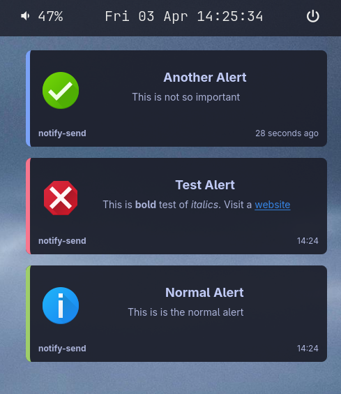

# Communique

A Linux notification daemon written in Rust using GTK4 and zbus.

## Screenshot



## Features

- D-Bus notifications interface (`org.freedesktop.Notifications`)
- Layer shell integration for floating notifications
- Action buttons support
- Urgency levels (low, normal, critical)
- Click to dismiss (for notifications without actions)
- Auto-dismiss timer
- Timestamp display ("X seconds ago" / "HH:MM" after 60s)
- Pango markup rendering for body text
- Icon support (64x64)

## Dependencies

You will need to install GTK4/GTK4 Layer Shell dependencies via your package manager. 

## Build

```bash
cargo build --release
```

## Run

```bash
./target/release/notifications-rs
```

For debug output:
```bash
RUST_LOG=debug ./target/release/notifications-rs
```

## Running as a User Service

Create `~/.config/systemd/user/notifications-rs.service`:

```ini
[Unit]
Description=Notification Daemon
PartOf=graphical-session.target
Requires=graphical-session.target
After=graphical-session.target
ConditionEnvironment=WAYLAND_DISPLAY

[Service]
Type=dbus
BusName=org.freedesktop.Notifications
ExecStart=%h/.cargo/bin/notifications-rs
Restart=on-failure

[Install]
WantedBy=graphical-session.target
```

Then:
```bash
systemctl --user daemon-reload
systemctl --user enable --now notifications-rs
```

## Usage

Send notifications using `notify-send`:

```bash
# Basic notification
notify-send "Title" "Body text"

# With actions
notify-send -A action1="Accept" -A action2="Dismiss" "Title" "Body"

# With icon
notify-send -i /path/to/icon.png "Title" "Body"

# With urgency
notify-send -u critical "Title" "Body"

# With expire timeout (milliseconds)
notify-send -t 5000 "Title" "Body"
```

## D-Bus Interface

Implements `org.freedesktop.Notifications`:

- `Notify(app_name, replaces_id, app_icon, summary, body, actions, hints, expire_timeout) -> id`
- `CloseNotification(id)`
- `GetCapabilities() -> ["actions", "body"]`
- `GetServerInformation() -> (name, vendor, version, spec_version)`
- Signals: `ActionInvoked(id, action)`, `NotificationClosed(id, reason)`

## Styling

The daemon uses the Tokyo Night color scheme with CSS in `resources/style.css`.
